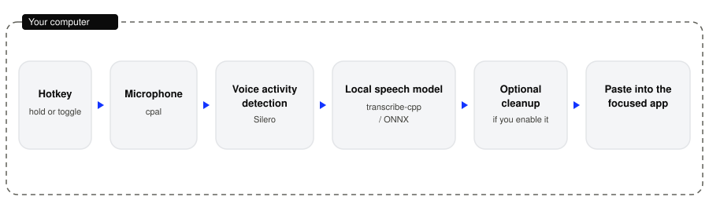

<p align="center">
  <picture>
    
  </picture>
</p>

<h1 align="center">Coco Voice</h1>

<p align="center">
  Desktop dictation for people who want speech typed into the app they already
  have open.
</p>

<p align="center">
  <a href="LICENSE"
    ></a>
  <a href="https://github.com/coco-research/Coco-Voice/releases/latest"
    ></a>
  
</p>

## Why it exists

Talking is faster than typing, but most dictation tools record you, send the audio to a server, and bill you monthly. Coco Voice runs the speech model on your own computer. Hold a key, speak, and the text is pasted into whatever field you are in: a chat, an editor, an email. No account, no subscription, and recognition works offline once your model is downloaded.

## Quick start

### For users

The current GitHub release is a macOS Apple Silicon disk image (`Coco-Voice_*_aarch64.dmg`). It is signed with a self-signed "Coco Research Code Signing" certificate and is not notarized, so Gatekeeper warns the first time you open it. Read [INSTALL.md](INSTALL.md). Windows and Linux are not in that release. Build them from source, below.

On an Apple Silicon Mac, download `Install Coco Voice.command` from the release (the asset is named `Install.Coco.Voice.command`) and double-click it. If macOS says it cannot be opened, right-click the file in Finder, choose Open, then Open. It runs the same installer as this command, which downloads the latest `.dmg`, copies Coco Voice into Applications, clears the quarantine flag, and launches it:

```bash
curl -fsSL https://raw.githubusercontent.com/coco-research/Coco-Voice/main/install.sh | bash
```

Or do it by hand:

1. Open the `.dmg` and drag **Coco Voice** into **Applications**.
2. Clear quarantine, then launch:

```bash
xattr -dr com.apple.quarantine "/Applications/Coco Voice.app"
open "/Applications/Coco Voice.app"
```

On first launch macOS asks for the microphone and for Accessibility. Accessibility is what lets the global shortcut and the paste keystroke work. After that, the app asks you to download a speech model. Nothing is transcribed until that download finishes. The default shortcut is hold Option+Space (push-to-talk). If you are moving to 0.9.5 from an older build, download it by hand once (0.9.5 is signed with a new update key, so older copies cannot update to it) and grant Accessibility once more: the signing certificate changed, and macOS ties that permission to the certificate.

### Build from source

You need Rust (stable), [Bun](https://bun.sh/), and cmake.

On macOS, install full Xcode and point the active developer directory at it (`sudo xcode-select -s /Applications/Xcode.app`). With only Command Line Tools, the Apple Intelligence bridge compiles as a stub. The published 0.9.5 disk image was built that way, so Apple Intelligence is unavailable in that download.

Windows also needs the Microsoft C++ build tools and the Vulkan SDK. Linux needs the libraries listed in [BUILD.md](BUILD.md), including cmake. Intel Macs have no prebuilt ONNX Runtime in this repo. [BUILD.md](BUILD.md) has the Homebrew link flags.

```bash
bun install

mkdir -p src-tauri/resources/models
curl -o src-tauri/resources/models/silero_vad_v4.onnx https://blob.handy.computer/silero_vad_v4.onnx

bun run tauri dev
```

If cmake stops on a policy error:

```bash
CMAKE_POLICY_VERSION_MINIMUM=3.5 bun run tauri dev
```

## What it does

- Hold a key to dictate, and the text lands in the focused app. Push-to-talk is the default (Option+Space on macOS, Ctrl+Space on Windows and Linux). Turn it off to toggle, or drive a running copy with `--toggle-transcription`.
- You pick a local model: Whisper, Parakeet, Moonshine, and other architectures, through transcribe-cpp, with older ONNX models through transcribe-rs.
- transcribe.cpp uses the GPU when one is there: Metal on macOS, Vulkan on Windows x64 and Linux, and the CPU otherwise. A Windows on ARM build of the speech engine is CPU only.
- You can clean a transcript afterwards through an OpenAI-compatible API, or through Apple Intelligence on Apple Silicon when that provider was compiled in. The 0.9.5 download does not include Apple Intelligence because the provider is a stub.
- Names and fixes stay local: custom words, whole-word corrections, and a transcript history stored in a database on disk.
- The settings window is translated into 22 languages.

## How it works

<p align="center">
  
</p>

The shortcut opens the microphone through cpal. Silero voice activity detection drops silence. A local model turns the speech into text: transcribe-cpp for the GGUF catalog, transcribe-rs for an older ONNX model. Cleanup is separate, and it runs only when that step is enabled and the chosen provider is actually available. The text is pasted into whichever app is focused.

## Status and roadmap

This is a beta. The version in the tree and the latest release are 0.9.5. See [CHANGELOG.md](CHANGELOG.md) for what changed. Today, on an Apple Silicon Mac, you can hold the shortcut, speak, and paste a local transcript, with history, custom words, and corrections. The app includes an updater that reads the latest GitHub release. The Mac build is self-signed and not notarized. Apple Intelligence is not in the 0.9.5 download.

Next:

1. A Coco-hosted model mirror, with sha256 checks on each download. [Pull request #2](https://github.com/coco-research/Coco-Voice/pull/2) is open.
2. Per-app profiles, plus cleanup that stays on the device with a local model. [Pull request #3](https://github.com/coco-research/Coco-Voice/pull/3) is open (still a draft).
3. Meeting mode: long-form capture and summaries on the device. Planned. There is no pull request yet.

## Models and licences

The application is [MIT](LICENSE). Each speech model keeps its own licence. The bundled catalog records a licence string for every model it lists. That set includes permissive licences and a non-commercial one (CC BY-NC 4.0). This branch does not show the string in the window. The catalog loader ignores the field.

The model-mirror pull request is where non-commercial models, and models held for licence review, come off the list of new downloads. A paid build is planned, and it will ship only models whose licences allow commercial use.

## Contributing

See [CONTRIBUTING.md](CONTRIBUTING.md) and [CONTRIBUTING_TRANSLATIONS.md](CONTRIBUTING_TRANSLATIONS.md).

Coco Voice is in a feature freeze. A pull request for a new feature the community has not asked for is rejected. If the community has asked for it, or you have gathered support for it, it may still be considered. Bug fixes come first. The freeze is spelled out in CONTRIBUTING.md.

## Licence

[MIT](LICENSE).

## Credits

Coco Voice is a fork of [Handy](https://github.com/cjpais/Handy) by CJ Pais, which is also MIT. Handy is the speech pipeline this app still runs: recording, local models, shortcuts, and paste. Thank you to CJ Pais and the Handy contributors.

On top of that fork, Coco Voice changed the name, the parrot mark, and the blue theme. It added the macOS install helper, an updater signed for this repository, and a stable self-signed Mac certificate so an Accessibility grant survives later updates. It also added Apple Intelligence as an on-device cleanup provider when the app is built with full Xcode, and a speak-a-correction shortcut that replaces the last dictation, including corrections learned from edits you make in history.

Key libraries: [transcribe-cpp](https://github.com/handy-computer/transcribe.cpp), transcribe-rs, Silero VAD, and [Tauri](https://tauri.app/).

## More

### Platforms

| Where you run it | What the code does                                                                                                              |
| ---------------- | ------------------------------------------------------------------------------------------------------------------------------- |
| macOS            | The published release is Apple Silicon only. transcribe.cpp uses Metal. First launch asks for the microphone and Accessibility. |
| Windows x64      | Source builds with Vulkan for transcribe.cpp. Not in the 0.9.5 release.                                                         |
| Windows on ARM   | The speech engine is compiled CPU-only. Not in the 0.9.5 release.                                                               |
| Linux            | Source builds with Vulkan. The recording overlay is off by default. Not in the 0.9.5 release.                                   |

On Linux, `HANDY_NO_GTK_LAYER_SHELL=1` skips the GTK layer-shell overlay. Wayland paste depends on a typing tool such as `wtype`, `ydotool`, `dotool`, or `xdotool`. Install notes and the long build troubleshooting (Windows path length, AppImage, Intel Mac ONNX Runtime) are in [BUILD.md](BUILD.md).

### Debug

`Cmd+Shift+D` on macOS, or `Ctrl+Shift+D` on Windows and Linux, toggles debug mode.

### Command line

These flags apply to this launch only. They do not change saved settings. If the app is already running, `--toggle-transcription`, `--toggle-post-process`, and `--cancel` are forwarded to it and the new process exits. Any other second launch brings the settings window forward.

```bash
coco-voice --toggle-transcription
coco-voice --toggle-post-process
coco-voice --cancel
coco-voice --start-hidden
coco-voice --no-tray
coco-voice --debug
```

`--transcribe-file` transcribes a 16 kHz mono WAV with a model that is already installed. It does not open the microphone, run voice activity detection, or download anything. `--json` prints that result as JSON. `--list-models` and `--list-devices` print what this build can load.
